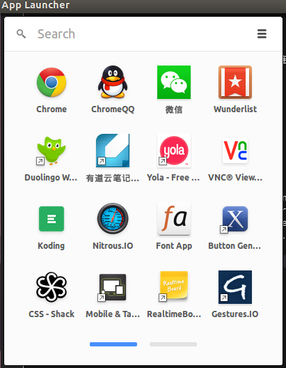

# 安装Ubuntu 14.10后要做的几件事

---

## 基础配置
**1. 更新软件源**

装好ubuntu的第一件事就是添加更快速的源，因为官方提供的源服务器在国外,访问和下载速度要比国内源慢些，可以采用一些国内公司和大学提供的更新源.

方法一：  在`System Settings -> Software & Updates`,在`Download from`中在中国区选择速度最快的服务器源。这种方法比使用命令行快很多。

方法二：命令行设置：
- 备份原有源,恢复时有用 `sudo cp /etc/apt/sources.list /etc/apt/sources.list.backup`
- 修改更新源，添加相应的镜像源(个人常用163源、yun-idc源) ` sudo gedit /etc/apt/sources.list`
- 更新源`sudo apt-get update` 然后再升级系统`sudo apt-get upgrade`


- - - 

**2. linux打开txt文件乱码**

缺省配置下，用Ubuntu的文本编辑器（gedit）打开GB18030（繁体中文用户可将GB18030替换成BIG5或BIG5-HKSCS）类型的中文编码文本文件时会发生乱码。这是因为gedit使用一个编码匹配列表，只有在这个列表中的编码才会进行匹配，不在这个列表中的编码将显示为乱码。您要做的就是将 GB18030 加入这个匹配列表。

- Gedit 2.x版本设置（适用于Ubuntu 11.04及以前）

安装gconf-editor： `sudo apt-get install gconf-editor`

手动方式：
在弹出的配置中选择：“apps”—“gedit2”—“preferences”—“encodings”。双击右边名称“auto-    detected”，在弹出的编辑键菜单中，添加编码GB18030，GBK，GB2312，移到最上面即可                         

命令行方式： 
```
gconftool-2 --set --type=list --list-type=string /apps/gedit-2/preferences/encodings/auto_detected
"[UTF-8,CURRENT,GB18030,ISO-8859-15,UTF-16]"
```

- Gedit 3.x版本设置（适用于Ubuntu 11.10及以后）

安装dconf-editor: `sudo apt-get install dconf-tools`

手动方式：
步骤类似，在org/gnome/gedit/preferences/encodings下添加中文编码方式

命令行方式:
```
gsettings set org.gnome.gedit.preferences.encodings auto-detected "['GB18030', 'UTF-8', 'CURRENT', 'ISO-8859-15', 'UTF-16']"
```


- - -

**3. 开机自动加载Windows分区**

a. 在root权限下查看分区： `fdisk -l`

b. 统计windows分区，执行如下命令
   `sudo mkdir -p /media/charles/{windows分区名字}`

c. 编辑描述各种文件系统信息的文件/etc/fstab,添加对应Windows分区信息： `sudo gedit /etc/fstab`

```
# <file system> <mount point> <type> <options> <dump> <pass>
# / was on /dev/sda6 during installation
UUID=df8a06fe-6507-4242-80bc-85db21b15c9b / ext4 errors=remount-ro 0 1
# swap was on /dev/sda5 during installation
UUID=911758dc-eba4-4624-abad-c9b4a2b1b3cf none swap sw 0 0

# reserved partition
/dev/sda1 /media/charles/reserc ntfs none 0 0

# windows partition
/dev/sda2 /media/charles/winc ntfs none 0 0

# work partition
/dev/sda3 /media/charles/work ntfs none 0 0
```

---

**4. 安装搜狗输入法**

a. 安装fcitx版本： `sudo apt-get install fcitx`

b. 下载32位或64位的Ubuntu deb版[搜狗输入法](http://pinyin.sogou.com/linux/?r=pinyin)

---

**5. 远程管理主机**

**A ssh命令行登陆**

a. ubuntu下开启ssh服务

安装ssh服务器： `sudo apt-get install openssh-server`
查看ssh服务是否在后台开启，出现了sshd字样表示ssh后台服务默认已开启
```
charles@charles-t400s:~$ ps -e | grep ssh
10588 ?        00:00:00 sshd
```

你的服务器也可以是Mac或者Windows，只需要安装ssh服务器，并开启ssh后台服务即可

b. Windows下安装ssh客户端 

- [secure shell client](http://www.wm.edu/offices/it/services/software/licensedsoftware/webeditingsftp/sshsecureshell/index.php)：免费开源，但中文显示乱码，无法传输中文乱码名的文件，不能记住密码

- [putty](http://www.putty.org/) : 占用内存最小，每次登陆时需要重新连接，可通过设置编码为UTF-8不会显示中文乱码

- **[Xshell和Xftp](http://www.netsarang.com/download/free_license.html)**: 商用软件，但有免费版，可以保存设置的登陆会话，能记住密码，传输文件和显示中文时都可以通过设置编码为UFT-8而不会产生乱码，效果最佳。
 
推荐使用XShell+Xftp软件，创建新会话，填写完ip地址、用户名和密码就可登陆你的Ubuntu服务器

**B 远程界面登陆服务器**

a. 安装x11vnc： `sudo apt-get install x11vnc`

b. 设置vnc连接密码，根据提示输入密码并保存：
```
charles@charles-t400s:~$ x11vnc -storepasswd
Enter VNC password: 
Verify password:    
Write password to /home/charles/.vnc/passwd?  [y]/n y
Password written to: /home/charles/.vnc/passwd
```
c. 启动vncserver:

- 后台自动启动
   1. `sudo cp ~/.vnc/passwd /etc/x11vnc.pass`
   2. 创建/etc/init/x11vnc.conf文件，内容如下：
```
start on login-session-start
script
       x11vnc -display :0 -auth /var/run/lightdm/root/:0 -forever -bg -o /var/log/x11vnc.log -rfbauth /etc/x11vnc.pass -rfbport 5900  
end script
```

- 单次手动启动: `x11vnc -forever -shared -rfbauth ~/.vnc/passwd`

d. 重启ubuntu系统，再在Windows上用vnc viewer登陆

输入VNC Server名字-IP地址：端口号，后再输入设置vnc的连接密码

e. x11vnc常用命令(待补充)

x11vnc -kill :1 杀掉1号端口的vnc server进程

---

**6. 基础软件**

由于平时开发主要在Ubuntu平台上，所以一般首先考虑软件的跨平台性，下面是个人经常使用的软件：

- 办公软件： [WPS for Linux](http://community.wps.cn/download/) + Ocular阅读器
- 影音播放： Audacious + VLC + [SMPlayer](http://smplayer.sourceforge.net/en/downloads)结合使用
- 你懂的: [GAE](https://github.com/goagent/goagent) 
> 下载并遵循说明：https://github.com/goagent/goagent/blob/wiki/InstallGuide.md 
> 1. 让linux上先连上一小时VPN,保证连接gmail邮箱时能访问 
> 修改local下面的proxy.ini，添加appid-charlesxiong1314 
> 2. 运行server下面的文件：python uploader.py 
> 输入appid，邮箱和密码  
> 3. linux下在local中运行sudo python proxy.py(保证根管理员权限，添加证书) 
> 然后在Chrome中导入证书：Settings->HTTPS/SSL->Authorities->Import,导入local下CA.crt,全部勾选,否则会出现Privacy error:Your connection is not private 
> 4. 给Chrome安装SwitchySharp扩展 
> 从local中导入备份文件SwitchyOption.bak,更新自动切换规则(先运行goagent再更新规则)，出现error downloading list一般是上一步证书没导入进去
> 5. 开机自动启动
> 先安装gtk托盘和python-vte
> ```
> sudo apt-get install python/python-dev/python-gevent
> sudo apt-get install python-appindicator python-vte
> ```
> 再在local文件夹下运行python addto-startup.py即可加入开机启动。

- 浏览器：[Google Chrome](http://www.google.cn/intl/zh-CN/chrome/browser/desktop/index.html) + 扩展插件(Proxy SwitchSharp、Vimium、Adblock)+App(安装QQ、微信，特别建议在Windows的Chrome浏览器安装vnc viewer,如下图所示)



- 截图工具：shutter(`sudo apt-get install shutter`)
- 跨平台思维导图： [XMind](http://www.xmind.net/download/linux/)
- Markdown编辑器： [haroopad](http://pad.haroopress.com/user.html)

---

## 开发环境
* **完善GCC/Python环境**
* **配置Vim**
* **安装GAE**
* **解决Sublime text3无法输入中文的问题**
* **安装Eclipse**
* **Node.js开发部署集成测试管理**

**1 源码安装[Node.js](http://nodejs.org/dist/node-latest.tar.gz)**

```
   tar -zxvf node-latest.tar.gz 
   rm -f node-latest.tar.gz 
   cd node-v* 
  ./configure 
  make 
  sudo make install 
```
Node.js安装时默认安装了npm,查看两者是否安装成功
```
charles@charles-t400s:~$ node --version
v0.10.33
charles@charles-t400s:~$ npm --version
1.4.28
```
**2  Yeoman & Grunt & Bower**

**[Yeoman](http://yeoman.io/)** : 使用Web开发的最佳实践方式，为开发者提供一系列健壮的工具、程序库和工作流，帮助他们快速构建出漂亮、引人注目的Web应用。

它能够解决哪些前端问题呢？
> 统一开发团队代码风格和开发规范

> 维护和使用开发的组件库

> 模块化前端项目

> 服务器部署前是否压缩？流程如何简化


它不仅是一个工具，而且也是一个工作流。它由三种核心工具组成，致力于提高你构建Web App时的生产力和满意度，分别是：
- **[Yo](https://github.com/yeoman/yo)** ：脚手架工具，用于搭建新应用的脚手架，编写你的Grunt配置，提交相关Grunt任务，创建你需要的Bower库依赖
- **[Grunt](http://gruntjs.com/)** ：任务构建工具，用于自动化处理诸如代码最小化，代码编译，单元测试，代码规范等重复性任务
- **[Bower](http://bower.io/)** ：包管理工具，用于包依赖管理，无需手动下载和管理你的脚本，用它可以对库进行搜索,自动安装，检查更新，确保依赖关系等，管理Web站点的各种资源，比如框架，库，公共部分等

统一安装：`sudo npm install -g yo bower grunt-cli karma-jasmine `

检查是否安装成功：
```
charles@charles-t400s:~$ yo -v
1.3.3
charles@charles-t400s:~$ bower -v
1.3.12
charles@charles-t400s:~$ grunt -v
grunt-cli: The grunt command line interface. (v0.1.13)

Fatal error: Unable to find local grunt.

If you're seeing this message, either a Gruntfile wasn't found or grunt
hasn't been installed locally to your project. For more information about
installing and configuring grunt, please see the Getting Started guide:

http://gruntjs.com/getting-started
# 这里需要定位到含Gruntfile的项目目录下才调用运行已经安装好的Grunt
# 添加Grunt和插件到现有的一个package.json,在root模式下在项目目录中本地安装module
# Karma是一个基于Node.js的JavaScript测试执行过程管理工具（Test Runner）。
# Karma可用于测试所有主流Web浏览器，也可集成到CI（Continuous integration）工具
# Jasmine是一款 JavaScript BDD（行为驱动开发）测试框架
# Jasmine不依赖于其他任何JavaScript组件，有干净清晰的语法，可以很简单的写出测试代码。
sudo npm install grunt --save-dev
```
**3 创建一个Angular Web项目**

A. 安装生成器和搭建脚手架
```
sudo apt-get install ruby ruby-compass # root模式下安装ruby和compass
sudo npm install -g generator-angular #安装angular生成器
mkdir angular-hello  #创建项目文件夹
yo angular webapp   # 搭建一个AngularJs应用程序的脚手架
```
B. 安装库依赖- npm,bower
```
rm -rf node-modules/  #上面步骤有部分库没装成功，需要root权限，因而需重新安装
sudo npm install   #安装默认依赖
sudo npm install grunt-karma karma-phantomjs-launcher karma-jasmine --save-dev
```

```
bower install && bower install underscore #根据所需从bower中安装库
bower install --save-dev xxx
```

C. Grunt自动化任务
```
sudo npm install grunt --save-dev   #把新版Grunt到你的项目中，并自动添加到你的项目依赖
grunt test   #测试你的应用
grunt serve  #预览你的应用
grunt        #部署构建你的应用
```

**4 持续集成平台-Travis** 

Travis是一个持续集成(CI)平台

**5 线上部署应用-Heroku**

Heroku是一种Pass平台，目前支持多种语言环境，无需你配置服务器，数据库，也不需要理会负载均衡，一切都可在平台上直接获取。你只需专注于自己的业务，把应用的逻辑写好，部署到线上，非常适合开发一些demo Web应用。

一.  常规Node.js App,例如**[Node-hello](https://github.com/charlesxiong/node-hello)** ,部署稍微简单

A. 注册Heroku，下载Heroku工具包：

```
wget -qO- https://toolbelt.heroku.com/install-ubuntu.sh | sh
```

B. 登陆Heroku并在项目目录执行：
```
charles@charles-t400s:~/node-hello$ heroku login
Enter your Heroku credentials.
Email: haojun.xiong2010@gmail.com
Password (typing will be hidden): 
Authentication successful.

charles@charles-t400s:~/node-hello$ heroku create
Creating hidden-inlet-5897... done, stack is cedar-14
https://hidden-inlet-5897.herokuapp.com/ | https://git.heroku.com/hidden-inlet-5897.git
Git remote heroku added

```

C. 创建一个Procfile并把本地的master分支推送到heroku这个远端地址

Profile的内容：
```
web: node index.js
```

推送部署到Heroku中：
```
charles@charles-t400s:~/node-hello$ git remote -v    #查看远程库
heroku	https://git.heroku.com/hidden-inlet-5897.git (fetch)
heroku	https://git.heroku.com/hidden-inlet-5897.git (push)
origin	git@github.com:charlesxiong/node-hello (fetch)
origin	git@github.com:charlesxiong/node-hello (push)

charles@charles-t400s:~/node-hello$ git push heroku master
Counting objects: 29, done.
Delta compression using up to 2 threads.
Compressing objects: 100% (26/26), done.
Writing objects: 100% (29/29), 3.03 KiB | 0 bytes/s, done.
Total 29 (delta 10), reused 3 (delta 0)
remote: Compressing source files... done.
remote: Building source:
remote: 
remote: -----> Node.js app detected
remote: ....
remote:        Procfile declares types -> web
remote: 
remote: -----> Compressing... done, 5.7MB
remote: -----> Launching... done, v3
remote:        https://hidden-inlet-5897.herokuapp.com/ deployed to Heroku
remote: 
remote: Verifying deploy... done.
To https://git.heroku.com/hidden-inlet-5897.git
 * [new branch]      master -> master
```

D. 查看发布的应用网址：https://hidden-inlet-5897.herokuapp.com/ 或者执行`heroku open`


二. 部署一个Yeoman/Angular App到Heroku中

**6 集大成者：开发测试部署运维自动化-Docker**

参考Lesson 5: [ Docker开发环境配置](https://github.com/charlesxiong/linux-lessons/blob/master/lesson5/5.0.md)


* **Python开发管理**


